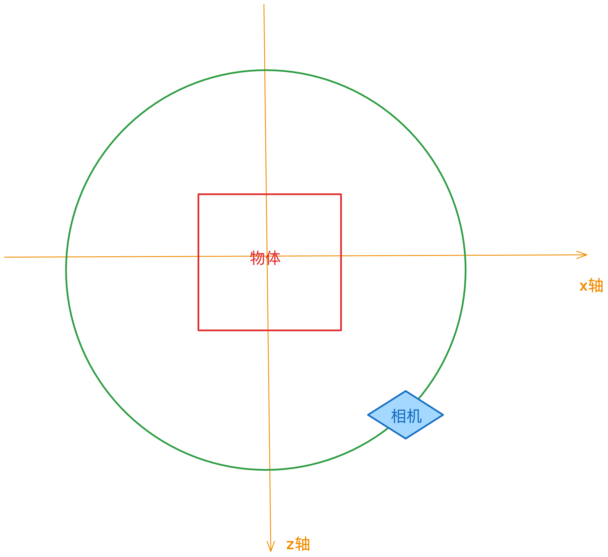

### # 0.1 相机

在 Three.js 中，必须要有一个相机存在于场景中，才能够看见场景中的物体，Three.js 一共提供了5种相机：

1. [ArrayCamera](https://threejs.org/docs/api/en/cameras/ArrayCamera.html)
2. [CubeCamera](https://threejs.org/docs/api/en/cameras/CubeCamera.html)
3. [OrthographicCamera](https://threejs.org/docs/api/en/cameras/OrthographicCamera.html)
4. [PerspectiveCamera](https://threejs.org/docs/api/en/cameras/PerspectiveCamera.html)
5. [StereoCamera](https://threejs.org/docs/api/en/cameras/StereoCamera.html)

#### ## 0.0.1 ArrayCamera

ArrayCamera 是一组相机，常用于渲染多个视角的场景，比如虚拟现实（VR）场景。

[例子](https://threejs.org/examples/#webgl_camera_array)

#### ## 0.0.2 CubeCamera

CubeCamera 相机是由6个相机组成，这6个相机分别看向上、下、左、右、前、后的方向，这样一来 CubeCamera 相机就可以全方位的观察场景了，这个相机非常适合在由镜面反射、折射和观察整个环境的场景下使用。

举个例子来说，在 Three.js 中想要实现镜子的效果，就要用到这个相机。

#### ## 0.0.3 OrthographicCamera

正交相机可以想象成一个视角为矩形的相机，这个相机的特点在于没有透视效果，就是物体不论距离相机多远看见的物体都是物体原本的尺寸。

官方提供的例子可以很直观的看到: [OrthographicCamera](https://threejs.org/examples/#webgl_camera)

#### ## 0.0.4 PerspectiveCamera

透视相机是最好理解的，因为和我们的眼睛一样，看到物体都是近大远小的。

因为这个相机比较常用，所以这里再详细的说一下它的参数：

1. 视场角（fov）：视场角就像是相机的“变焦”功能，决定了你能看到多宽的画面。较大的视场角意味着能够看到更多的画面，就像广角镜头一样。较小的视场角则意味着只能看到狭窄的画面，就像长焦镜头一样。

2. 宽高比（aspect）：宽高比是你渲染画面的比例。如果你的渲染区域是正方形的，宽高比就是 1。如果你的渲染区域更宽一些，宽高比就会大于 1。了解宽高比很重要，因为它可以保持物体在不同屏幕尺寸上的正确比例。

3. 近平面（near）：近平面是相机能够看到的最近的距离。任何离相机比这个距离更近的物体都将被剪裁掉，不会显示在渲染的画面中。

4. 远平面（far）：远平面是相机能够看到的最远的距离。任何离相机比这个距离更远的物体也将被剪裁掉，不会显示在渲染的画面中。

这里需要注意一个点：避免将 near 和 far 设置为极端值，设置为极端值有可能出现 [Z-fighting](https://en.wikipedia.org/wiki/Z-fighting) 问题。

#### ## 0.0.4 StereoCamera

StereoCamera 是用于创建立体（3D）效果的相机，通常用于创建立体视图或虚拟现实（VR）场景。它通过同时使用两个相机来模拟人眼的视觉，从而实现立体感。

[例子](https://threejs.org/examples/#webgl_effects_stereo)

### # 0.2 实现一个让相机跟随鼠标移动的效果

[👉点击查看效果](/playground/threejs/immersion)

- 需求：要求相机的视角跟随鼠标移动。
- 实现：

  1. 初始化场景

     ```javascript
     const root = document.querySelector(".app");
     const { width } = root.getBoundingClientRect();

     const sizes = {
       width,
       height: 600,
     };

     const scene = new THREE.Scene();
     const geometry = new THREE.BoxGeometry(1, 1, 1);
     const material = new THREE.MeshBasicMaterial({ color: 0x00ff00 });
     const mesh = new THREE.Mesh(geometry, material);

     const camera = new THREE.PerspectiveCamera(75, sizes.width / sizes.height);
     camera.position.z = 3;

     const canvas = document.createElement("canvas");
     const renderer = new THREE.WebGLRenderer({ canvas });
     renderer.setSize(sizes.width, sizes.height);

     scene.add(mesh, camera);
     renderer.render(scene, camera);

     const tick = () => {
       renderer.render(scene, camera);
       requestAnimationFrame(tick);
     };

     root.appendChild(canvas);
     tick();
     ```

     这段代码会实现一个包含绿色立方体的场景

  2. 确认鼠标移动的范围

     先要明确一点就是只有鼠标在画布（canvas元素）上移动，相机的视角才会跟随鼠标，那么鼠标在 Y 轴的移动范围就是画布的`height`，在 X 轴的移动范围就是画布的`width`。

     为了方便计算，假设鼠标在 X 轴的移动范围是(-0.5 ~ 0.5)， Y 轴的移动范围也是(-0.5 ~ 0.5)，这样这个坐标的取值范围正好就是 1。

     为了实现这个，需要对鼠标当前的位置进行**归一化**。

     ```javascript
      const cursor = {
        x: 0,
        y: 0,
      };

      // 代替 getBoundingClientRect，因为频繁调用 getBoundingClientRect 会有性能问题
      const getElementRect = (element: HTMLElement) => {
        return new Promise<DOMRect>((resolve) => {
          const observer = new IntersectionObserver((entries) => {
            resolve(entries[0].boundingClientRect);
            observer.disconnect();
          });

          observer.observe(element);
        });
      };

      canvas.addEventListener("mousemove", async ({ clientX, clientY }) => {
        const { x, y } = await getElementRect(canvas);
        const startX = clientX - Math.abs(x);
        const startY = clientY - Math.abs(y);

        cursor.x = startX / sizes.width - 0.5;
        cursor.y = startY / sizes.height - 0.5;
      });
     ```

  3. 对相机的`position`属性进行同步修改

     ```javascript
     const tick = () => {
       camera.position.x = cursor.x * 5;
       camera.position.y = -cursor.y * 5;
       renderer.render(scene, camera);
       requestAnimationFrame(tick);
     };
     ```

     因为浏览器的页面中 Y 轴的正方向向下，这个 Three.js 中相反，所以y的取值要加上负号，后面的乘以5只是为了让相机的偏移幅度大一点，可以自己进行调试修改。

  4. 看不到物体的背面

     假设物体面向用户的那一面为正面，与之对应的面就是背面，在现在的情况下那个面无论怎么偏移相机都无法看见，如果想要看见背面需要相机在物体周围做圆周运动。

     圆周运动就要说到单位圆的概念了，如果从俯视视角看物体，相机需要做的圆周运动就是下图中绿色的圆

     

     在单位圆的概念中：

     ```
      cos(t) = x
      sin(t) = y
     ```

     根据示例图中可以知道，如果把场景带入到单位圆的概念中相机的y轴对应的就是场景中的z轴，但实际上不是这样的...

     实际上场景中的x轴对应y轴，场景中的z轴对应x轴，为什么会这样的，我自己的理解是因为这是三维场景，所以这里做圆周运动应该使用的是球坐标系，球坐标系可以看[维基百科](https://zh.wikipedia.org/wiki/%E7%90%83%E5%BA%A7%E6%A8%99%E7%B3%BB)的文档，这个文档里面有一张示意图，一看就明白了。

     所以代码可以写成这样：

     ```javascript
     const tick = () => {
       camera.position.x = Math.sin(Math.PI * 2 * cursor.x) * 5;
       camera.position.z = Math.cos(Math.PI * 2 * cursor.x) * 5;
       camera.position.y = -cursor.y * 5;

       renderer.render(scene, camera);
       requestAnimationFrame(tick);
     };
     ```

     解释一下为什么要这么写：

     1. x轴的范围经过归一化之后范围是： -0.5～0.5
     2. 需求是希望看到物体的背面，所以从-0.5移动到0.5需要旋转360度，对应的弧度就是`Math.PI * 2`。
     3. 当相机偏移至-0.5的时候就是`-0.5 * Math.PI * 2`结果是-180度（在弧度制中$\pi$等于180度）
     4. 当相机偏移至0.5的时候就是`0.5 * Math.PI * 2`结果是180度
     5. `Math.sin(Math.PI * 2 * cursor.x) * 5` 和 `Math.cos(Math.PI * 2 * cursor.x) * 5` 中乘以的5只是为了让相机偏移的幅度大一点，否则相机会离物体太进了。

     写成这样后还是有点小问题，相机偏移的时候物体会移除相机的视角之外，还需要加上这句代码：

     ```javascript
     camera.lookAt(mesh.position);
     ```

     让相机始终看向物体的位置。

  5. 修改一下物体每个面的颜色，让旋转更加明显

     ```javascript
     const geometry = new THREE.BoxGeometry(1, 1, 1).toNonIndexed();
     const material = new THREE.MeshBasicMaterial({ vertexColors: true });

     const vertices = geometry.getAttribute("position");
     const colors = [];
     const color = new THREE.Color();
     for (let i = 0; i < vertices.count; i += 6) {
       color.setHex(0xffffff * Math.random());

       colors.push(color.r, color.g, color.b);
       colors.push(color.r, color.g, color.b);
       colors.push(color.r, color.g, color.b);

       colors.push(color.r, color.g, color.b);
       colors.push(color.r, color.g, color.b);
       colors.push(color.r, color.g, color.b);
     }

     geometry.setAttribute(
       "color",
       new THREE.Float32BufferAttribute(colors, 3),
     );

     const mesh = new THREE.Mesh(geometry, material);
     ```

### # 0.3 Controls

Three.js 内置了很多名叫 `Controls` 的工具，比如上面实现的相机跟随鼠标效果，Three.js 就内置了这个工具，而且做的更完善，还有放大缩小的功能。

不同类型的`Controls`有不同的效果，具体的可以在 Three.js 的文档中搜索`Controls`关键字。

上面实的相机跟随鼠标效果，用`Controls`来实现是这样的：

```javascript
import { OrbitControls } from "three/addons/controls/OrbitControls.js";

const camera = new THREE.PerspectiveCamera(90, sizes.width / sizes.height);

camera.position.z = 5;

const control = new OrbitControls(camera, canvas);
control.enableDamping = true;

const tick = () => {
  control.update();
  renderer.render(scene, camera);
  requestAnimationFrame(tick);
};

tick();
```

### # 0.3 Helper

Three.js 除了内置了许多 Controls 工具之外，还内置了一些 `Helper` 工具，比如：AxesHelper（助手）、CameraHelper（相机助手）、DirectionalLightHelper（平行光助手）。

`Helper`类型的工具主要是用于指示的，比如光源的助手，就会将光源的范围、方向、光源位置展示出来方便调试。

### # 0.4 沉浸式体验

这里的沉浸式体验就是让画布填充整个屏幕，使场景更加具有冲击力，就像是在电影院看电影和在电脑上看电影是不同的感觉一样。

这里优化的手段有：

1. 全屏
2. 禁止页面滚动或者让页面的背景和场景的背景颜色一致。
   1. 禁止滚动的原因是在 MacOS 系统的电脑上可以滚动到页面极限之外，比如滚动到底部后，再用触控板进行滚动，就会看到白色的底部。
3. 监听浏览器窗口尺寸变化，始终让画布填充整个屏幕。

接下来之前学习到的知识点，实现一个简单的动画效果。[👉点击查看效果](/playground/threejs/immersion-1)

1. 初始化场景、相机、物体

   ```javascript
    const root = document.querySelector(".app")!;
    const { width } = root.getBoundingClientRect();

    const sizes = {
      width,
      height: 600,
    };

    const scene = new THREE.Scene();

    const geometry = new THREE.BufferGeometry();
    const material = new THREE.MeshBasicMaterial({
      color: 0x00ff00,
      wireframe: true,
    });

    const trianglesConfig = {
      counts: 300,
    };

    const vertices = new Float32Array(trianglesConfig.counts * 9);

    for (let index = 0; index < vertices.length; index++) {
      vertices[index] = (Math.random() - 0.5) * 5;
    }

    geometry.setAttribute("position", new THREE.BufferAttribute(vertices, 3));

    const mesh = new THREE.Mesh(geometry, material);
    const camera = new THREE.PerspectiveCamera(75, sizes.width / sizes.height);
    camera.position.z = 10;

    const canvas = document.createElement("canvas");
    const renderer = new THREE.WebGLRenderer({ canvas });
    renderer.setSize(sizes.width, sizes.height);

    scene.add(mesh, camera);
    renderer.render(scene, camera);

    const tick = () => {
      renderer.render(scene, camera);
      requestAnimationFrame(tick);
    };

    root.appendChild(canvas);
    tick();
   ```

2. 添加Controls 和 Helper

   ```javascript
   import { OrbitControls } from "three/addons/controls/OrbitControls.js";

   const axes = new THREE.AxesHelper(10);
   const controls = new OrbitControls(camera, renderer.domElement);
   controls.enableDamping = true;
   controls.update();

   scene.add(axes);

   const tick = () => {
     controls.update();
     renderer.render(scene, camera);
     requestAnimationFrame(tick);
   };
   ```

3. 处理浏览器默认样式

   ```css
   body {
     margin: 0;
   }

   html,
   body {
     overflow: hidden;
   }

   canvas {
     position: fixed;
     top: 0;
     left: 0;
     outline: none;
   }
   ```

4. 处理视口尺寸变化

   ```javascript
   window.addEventListener("resize", () => {
     sizes.width = window.innerWidth;
     sizes.height = window.innerHeight;

     // 更新相机
     camera.aspect = sizes.width / sizes.height;
     camera.updateProjectionMatrix(); // 修改完相机参数后需要更新一下相机的投影矩阵

     // 更新渲染器
     renderer.setSize(sizes.width, sizes.height);
     renderer.render(scene, camera);
   });
   ```

5. 添加动画

   ```bash
   # 安装依赖
   yarn add gsap
   ```

   ```javascript
   import { gsap, Linear } from "gsap";

   gsap.to(mesh.rotation, {
     y: 2 * Math.PI, // 围绕 Y 轴旋转一圈（用弧度单位）
     ease: Linear.easeNone, // 缓动函数，匀速旋转
     duration: 5, // 动画持续时间
     repeat: -1, // 重复次数，-1 表示无限次数
   });
   ```

6. 优化渲染效果

   由于不同的屏幕有不同的像素比，它指的是：物理像素和独立像素的比例。

   - 物理像素可以理解为屏幕上真实的像素点
   - 独立像素可以理解为代码中的像素，比如css中的 `1px`

   当像素比为1的时候，独立像素的1px需要1个物理像素来渲染，当像素比为2的时候，独立像素的1px需要4个物理像素来渲染。

   这里需要设置一下 `renderer` 的像素比，让它符合当前屏幕的像素比：

   ```javascript
   renderer.setPixelRatio(Math.min(window.devicePixelRatio, 2));
   ```

   这里有一个小技巧，像素比最大值最好设置为2，过大的像素比，会带来性能问题。

   同时也需要在视口发生变化的时候进行设置，因为有可能出现用户将页面拖动至其他屏幕的情况：

   ```javascript
   window.addEventListener("resize", () => {
     render.setPixelRatio(Math.min(window.devicePixelRatio, 2));
   });
   ```

7. 增加全屏功能

   ```javascript
   window.addEventListener("dblclick", () => {
     if (document.fullscreenElement) {
       document.exitFullscreen();
     } else {
       canvas.requestFullscreen();
     }
   });
   ```
