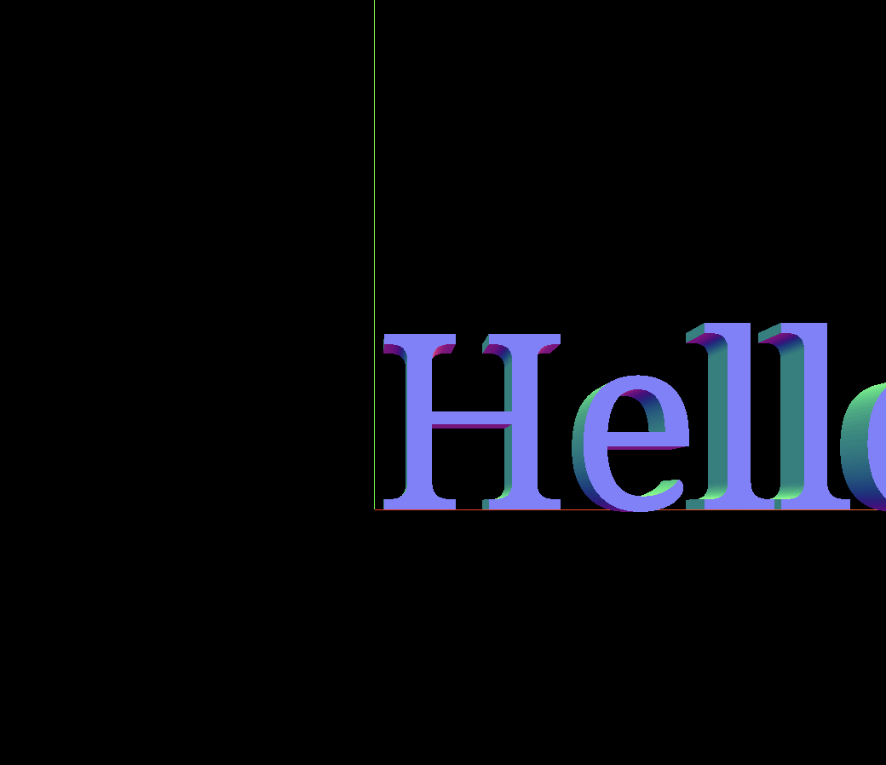

### # 0.1 Text

想要使用 Three.js 的文字功能，需要字体文件格式为`json`的字体，这个网站可以将其他格式的字体转换成`json`格式：[Facetype.js](https://gero3.github.io/facetype.js/)，使用字体的时候还要注意一下版权问题。

这一次实现一个好看的包含文字的场景，这个场景是模仿 [ilithya](https://www.ilithya.rocks/about/#contact-me) 这位艺术家的作品，她的作品地址是：[ilithya.rocks](https://www.ilithya.rocks/)。

在 Three.js 中使用字体，需要用到：

1. FontLoader
2. TextGeometry

```javascript
import { TextGeometry } from "three/addons/geometries/TextGeometry.js";
import { FontLoader } from "three/addons/loaders/FontLoader.js";
import droidFont from "three/examples/fonts/droid/droid_serif_regular.typeface.json?url";

const fontLoader = new FontLoader();

fontLoader.load(typefaceFont, (font) => {
  const geometry = new TextGeometry("Hello Three.js", {
    font,
    // 字体大小
    size: 0.5,
    // 字体厚度（z轴）
    height: 0.2,
    // 字体曲面的分段数
    curveSegments: 12,
    // 以下部分都是关于字体斜角的配置
    bevelEnabled: true,
    bevelThickness: 0.03,
    bevelSize: 0.02,
    bevelOffset: 0,
    bevelSegments: 5,
  });

  const mesh = new THREE.Mesh(geometry, new THREE.MeshNormalMaterial());
  scene.add(mesh);
});
```

FontLoader 和 TextGeometry 都不在 Three.js 的主包中，需要单独引入。

Three.js 的包中带了一些字体可以使用，这些字体都在 Three.js 包的 `/examples/fonts` 目录下。

有两个字体的配置不太好理解，解释一下：

- curveSegments

  这个参数会影响文字曲面的光滑程度，越高意味着分片的三角形数量越多。

- bevelEnabled

  字体斜角相关的配置，是影响字体边缘的参数，默认字体边缘是锐利（可以理解为直角）的，当开启了斜角后会呈现圆角的效果。

[👉点击进行调试](/playground/threejs/text)

### # 0.2 居中一个物体

想要居中一个物体首先需要知道物体的尺寸和当前所处的位置，首先在场景中添加一个`AxesHelper`。



可以看到文字的起始位置几乎是在场景的中心（0，0，0），只要放大看就会发现文字距离场景的中心还有一段距离。

知道了位置信息后，就需要物体的尺寸信息了。

Three.js 的几何形状有两个属性[boundingBox](https://threejs.org/docs/index.html#api/en/core/BufferGeometry.boundingBox) 和 [boundingSphere](https://threejs.org/docs/index.html#api/en/core/BufferGeometry.boundingSphere)，这两个属性可以知道物体的占地面积，boundingBox 和 boundingSphere 的意思就是给物体外层包裹一个矩形或者球形，在维基百科中有一个示意图，一看就明白，[地址](https://en.wikipedia.org/wiki/Minimum_bounding_box)。

只要获取到 `boundingBox` 或者 `boundingSphere` 的值就能知道物体的尺寸信息。

```javascript
geometry.computeBoundingBox();
console.log(geometry.boundingBox);
/**
 * 得到的结果是这样的
 * {
 *  max: {
 *    x: 4.560500144958496
 *    y: 0.5274999737739563
 *    z: 0.20000000298023224
 *  },
 *  min: {
 *    x: 0.026000000536441803
 *    y: -0.16699999570846558
 *    z: 0
 *  }
 * }
 */
```

获取 `boundingBox` 或者 `boundingSphere` 的值的时候一定要先调用一下 `computeBoundingBox()` 或者 `computeBoundingSphere()`。

通过 `max` 和 `min` 的信息，就能知道物体有多长了，现在居中只需要将 `max.x` 减去 `min.x` 再除以2就可以了。

```javascript
const { max, min } = text.geometry.boundingBox;

geometry.translate(
  -(max.x - min.x) / 2,
  -(max.y - Math.abs(min.y)) / 2,
  -(max.z - min.z) / 2,
);
```

因为y的的min值是负数，所以取了绝对值。

使用 `translate` 而不是 `position` 的原因是：`translate` 是在当前位置的基础上进行相对移动，这样偏移完成后，物体实际的位置信息还是`(0, 0, 0)`。

这种居中还有一个更简单的方法：`center`，上面那一堆代码可以直接简化成：

```javascript
geometry.center();
```

### # 0.3 实现最终的场景

实现笔记开始说的那种效果，难点就在于文字的居中和批量创建物体，居中已经解决了，批量创建物体也很简单：

```javascript
const meshesGroup = new THREE.Group();

const material = new THREE.MeshNormalMaterial();
const donutGeometry = new THREE.TorusGeometry(0.4, 0.2);
const cubeGeometry = new THREE.BoxGeometry(0.5, 0.5, 0.5);

const counts = 150;

for (let index = 0; index < counts; index++) {
  const cube = new THREE.Mesh(cubeGeometry, material);
  const donut = new THREE.Mesh(donutGeometry, material);

  cube.position.set(
    (Math.random() - 0.5) * 2 * 20,
    (Math.random() - 0.5) * 2 * 20,
    (Math.random() - 0.5) * 2 * 20,
  );

  donut.position.set(
    (Math.random() - 0.5) * 2 * 20,
    (Math.random() - 0.5) * 2 * 20,
    (Math.random() - 0.5) * 2 * 20,
  );

  meshesGroup.add(cube, donut);
}
```

将创建的物体都放进一个组中的原因是方便后续添加动画，如果想要添加动画只需要对这个组进行修改：

```javascript
gsap.to(meshesGroup.rotation, {
  y: Math.PI * 2,
  x: Math.PI * 2,
  duration: 25,
  ease: Linear.easeNone,
  repeat: -1,
});
```

[👉最终效果](/playground/threejs/text)
