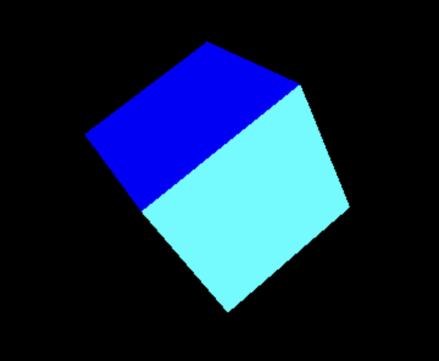
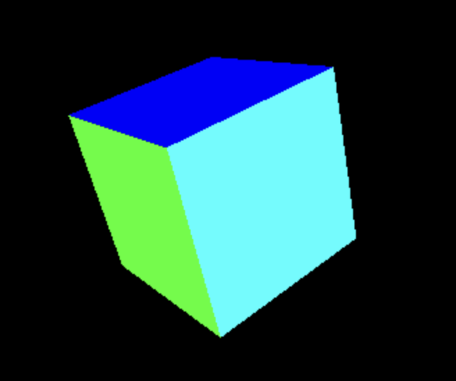

### # 0.1 Transform

在 Three.js 可以对物体进行这三种变换：

1. 位置（position）
2. 缩放（scale）
3. 旋转（rotation、quaternion）

其中旋转有两种方式：rotation 和 quaternion。

quaternion 是四元数的意思，它也可以进行旋转，为什么会有两种方式进行旋转，是因为`rotation`使用*欧拉角*进行旋转，*欧拉角*会导致一个叫做*万向锁*的问题，简单来说*万向锁*就是物体在旋转过程只有两个轴生效，就像是丢失了一个轴，用`quaternion`方式则可以避免这个问题。

### # 0.2 Position

Position 可以修改物体的位置信息，在 Three.js 中只要对象继承自 [Object3D](https://threejs.org/docs/index.html?q=mesh#api/en/core/Object3D) 这个类，这个对象就有 position属性，可以这样进行位置信息的修改

```javascript
const mesh = new THREE.Mesh(geometry, material);

// 分别进行修改
mesh.position.x = 1;
mesh.position.y = -1;
mesh.position.z = 1;

// 一次性设置
mesh.position.set(1, 2, 3);
```

position 对象则继承自[Vector3](https://threejs.org/docs/index.html?q=mesh#api/en/math/Vector3)类，Vector是向量的意思，Vector3 就是三维向量的意思。

> 向量：**指一个同时具有大小和方向，且满足平行四边形法则的几何对象**。

可以将向量想象成一个箭头，这个箭头有两个特征：方向和长度。

三维向量用`(x, y, z)`三个坐标来表示在空间中的位置。

position对象还有两个比较常用的方法：

- normalize
  normalize 方法可以让向量的方向保持不变，但是长度为一，叫做归一化，归一化可以让计算在某些情况下变得方便，比如可以把页面的整个宽度归一化成 `-1` 到 `1` 之间进行计算，这样就可以不用考虑页面实际的宽度。

- distanceTo

  distanceTo 可以获得当前向量距离某一个向量的距离，比如：

  ```javascript
  // 获取物体至相机的距离
  console.log(mesh.position.distanceTo(camera.position));

  // 获取物体至(1, 1, 1)的距离
  console.log(mesh.position.distanceTo(new THREE.Vector3(1, 1, 1)));
  ```

  想要获取向量距离场景中心的距离可以使用:

  ```javascript
  mesh.position.length();
  ```

### # 0.3 Scale

Scale 很好理解就是缩放的意思，它和position对象一样，可以这样设置：

```javascript
// 分别进行修改
mesh.scale.x = 2;
mesh.scale.y = 2;
mesh.scale.z = 2;

// 一次性设置
mesh.scale.set(2, 2, 2);
```

可以看出来，缩放也要指定不同轴上的缩放程度，例子中的代码就是对物体在 (x,y,z) 轴上都放大至原尺寸的两倍。

### # 0.3 Rotation

Rotation 表示旋转，旋转的时候需要特别注意两个点：

1. 旋转使用弧度制
2. 旋转的顺序

我习惯使用角度来进行旋转，但是在 Three.js 中使用弧度来进行旋转，所以需要进行角度到弧度的换算：

> 如果 $\theta$ 是一个角度，那么它对应的弧度 $\theta_{rad}$可以通过以下公式计算：
>
> $\theta_{rad}$=$\dfrac{\pi}{180} \times \theta$
>
> 反之，如果 $\theta_{rad}$ 是一个弧度，那么对应的角度 $\theta$ 可以通过以下公式计算：
>
> $\theta$=$\dfrac{180}{\pi} \times \theta_{rad}$

更简单的记法是：$\pi$ = 180度，然后自己再进行换算。

通过公式可知，如果想要让物体围绕 X 轴旋转 90 度就是 $\pi \div 2$ ：

```javascript
mesh.rotation.z = Math.PI / 2;
```

根据旋转的顺序不同得到的结果也是不同的：

假如现在有这样一个立方体：[👉点击查看](/playground/threejs/transform-and-animation)，每个面都是不同的颜色。

`XYZ`的顺序进行旋转：

```javascript
mesh.rotation.reorder("XYZ");
mesh.rotation.set(0.5, 0.5, 0.5);
```

结果：



`ZYX`的顺序进行旋转：

```javascript
mesh.rotation.reorder("ZYX");
mesh.rotation.set(0.5, 0.5, 0.5);
```

结果：



可以[👉点击这里](/playground/threejs/transform-and-animation)进行测试。

### # 0.4 Quaternion

四元数我目前并还不能理解，实在是看不懂四元数到底是什么，只是知道它可以表示旋转，并且可以解决万向锁的问题，先来看看四元数怎么用：

```javascript
// 单独设置一个轴
const quaternion = new THREE.Quaternion();

quaternion.setFromAxisAngle(new THREE.Vector3(1, 0, 0), Math.PI / 3);

mesh.setRotationFromQuaternion(quaternion);
```

上面代码的意思是让物体围绕 X 轴旋转60度（Math.PI 为180度），四元数在使用的时候需要先指定一下旋转轴。

当然也可以指定多个轴：

```javascript
// 同时设置多个轴
const quaternion = new THREE.Quaternion();

const euler = new THREE.Euler(Math.PI / 2, Math.PI / 3, Math.PI / 4);

quaternion.setFromEuler(euler);

mesh.setRotationFromQuaternion(quaternion);
```

万向锁的现象可以通过这里观察[👉点击查看](/playground/threejs/transform-and-animation)。

通过控制面板给出的步骤，你会发现当物体以`ZYX`的顺序进行旋转的时候，先围绕 Z 轴旋转某个角度，再围绕 Y 轴旋转90度，最后再围绕 X 轴旋转某个角度，万向锁就出现了，最后不论让物体围绕 X 轴旋转还是围绕 Z 轴旋转，物体都在同一个轴上进行旋转，就像是丢失了一个轴。

### # 0.5 Group

在场景中如果有大量的物体，可以对物体进行分组，这样就可以对这个组进行变换组内的物体都会应用到这些变换。

```javascript
const group = new THREE.Group();

const cube1 = new THREE.Mesh(
  new THREE.BoxGeometry(1, 1, 1),
  new THREE.MeshBasicMaterial({ color: 0xff0000 }),
);

const cube2 = new THREE.Mesh(
  new THREE.BoxGeometry(1, 1, 1),
  new THREE.MeshBasicMaterial({ color: 0x00ff00 }),
);
cube2.position.x = 2;

const cube3 = new THREE.Mesh(
  new THREE.BoxGeometry(1, 1, 1),
  new THREE.MeshBasicMaterial({ color: 0x0000ff }),
);
cube3.position.x = -2;

group.add(cube1, cube2, cube3);
group.position.y = 1;

scene.add(group);
```

### # 0.6 Animation

Three.js 中动画效果是通过不断重新渲染 canvas 元素中的场景来实现的，浏览器提供了一个非常适合这种需求的api：`requestAnimationFrame`，这个方法可以让浏览器在下一次重绘之前调用一下传入的回调函数，调用的频率通常是60次每秒。

比如这样可以使物体做圆周运动：

```javascript
const clock = new THREE.Clock();
const tick = () => {
  const elapsedTime = clock.getElapsedTime();
  mesh.position.x = Math.cos(elapsedTime);
  mesh.position.y = Math.sin(elapsedTime);

  renderer.render(scene, camera);
  requestAnimationFrame(tick);
};

tick();
```

[👉点击查看](/playground/threejs/transform-and-animation)

```javascript
mesh.position.x = Math.cos(elapsedTime);
mesh.position.y = Math.sin(elapsedTime);
```

这样设置就可以让物体做圆周运动是因为单位圆的概念，如果把物体看成单位圆上的一个点，那么物体的坐标：

```
cos(t) = x
sin(t) = y
```

elapsedTime 是`const clock = new THREE.Clock();` 对象声明到当前经过的时间，如果把它看作成一个角度，那么就可以运用单位圆的概念让物体做圆周运动。

复杂的动画可以借助第三方库来实现[GSAP](https://gsap.com/resources/get-started/)。
