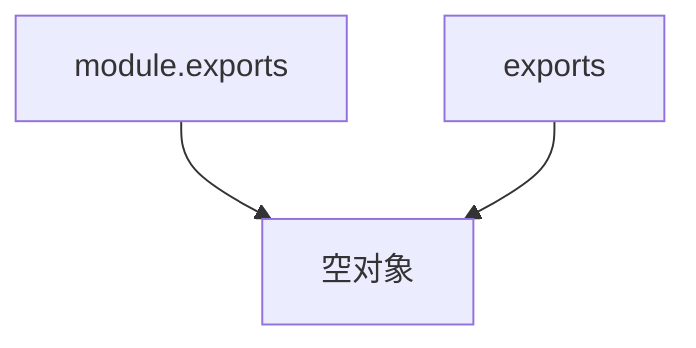

## 前言

开始系统的学习一下 Node.js，虽然一直在用，但是用到的 Node.js 相关的功能很少，基本上都是操作下文件，写点工程化相关的东西，这一次希望可以深入的掌握一下。

## 环境

- Node.js - 16.14.2
- macOS - 12.3.1
- ts-node - 10.7.0
- nodemon - 2.0.15
- TypeScript - 4.6.2

## Node.js 的基本概念

Node.js 是一个 JavaScript 的运行环境，它不是一个框架或者一门编程语言，还有一个大家都熟知的 JavaScript 运行环境就是浏览器，Node.js 内置了 Chrome 浏览器的 V8 引擎来编译和执行 JavaScript 代码，不过 Node.js 不提供 DOM 和 Web 相关的 API，它给 JavaScript 提供了调用操作系统 API 相关的能力，这使 JavaScript 拥有了开发后端应用的能力。

Node.js 最大的特点就是*异步I/O* + *事件驱动*，它和浏览器一样使用单线程执行 JavaScript，通过异步让单线程避免了阻塞的问题，同时又避免了多线程带来的状态同步、死锁、切换线程带来的开销等问题，但是注意的一点就是，Node.js 本身是不是单线程的。

这使得 Node.js 开发的应用很适合 I/O 密集型的场景，同时 V8 的性能也很不错，所以 CPU 密集型的场景也是可以胜任的。

## Node bindings

JavaScript 语言本身是没有调用操作系统 API 能力的，Node.js 使用 C/C++ 开发底层支持，通过一个中间层，让
JavaScript 代码和 C/C++ 代码可以相互调用，这中间层在 Node.js 的架构中叫做 *Node bindings*。

**e.g**

```c++
// hello.cc
#include <node.h>

namespace demo {
  using v8::FunctionCallbackInfo;
  using v8::Isolate;
  using v8::Local;
  using v8::Object;
  using v8::String;
  using v8::Value;

  // 定义函数
  void Method(const FunctionCallbackInfo<Value>& args) {
    Isolate* isolate = args.GetIsolate();
    args.GetReturnValue().Set(String::NewFromUtf8(isolate, "hello world").ToLocalChecked());
  }

  // 导出函数
  void Initialize(Local<Object> exports) {
    NODE_SET_METHOD(exports, "sayHello", Method);
  }

  NODE_MODULE(NODE_GYP_MODULE_NAME, Initialize)

}

```

这是一个使用 C++ 定义的函数，函数返回`hello world`，把这个函数命名成sayHello导出。

然后在项目根目录下创建一个 `binding.gyp` 配置文件

```json
{
  "targets": [
    {
      "target_name": "hello",
      "sources": [ "hello.cc" ]
    }
  ]
}
```


```bash
# node-gyp 是 Node.js 提供的编译工具
npm install -g node-gyp

# 生成构建配置
node-gyp configure

# 构建
node-gyp build
```

构建完成之后会得到一个 build 目录，编译后的文件是`build/Release/hello.node`。

然后就可以使用 JavaScript 调用这个 C++ 写的函数了

```js
// main.js

const { sayHello } = require('./build/Release/hello.node');

console.log(sayHello()); // hello world
```

这就意味着用 JavaScript 无法实现的功能，可以用 C/C++ 去实现，然后在 Node.js 中使用。


## 事件循环（event loop）

要更好的掌握 Node.js，需要理解事件循环的概念，我理解的事件循环是实现异步的一种机制。

Node.js 进程启动的同时会启动一个事件循环，可以想象成一个 `while(true)` 的循环。

这个事件循环的机制是 Node.js 的依赖库 *libuv* 提供的。

在 Node.js 中事件循环分为6个阶段，每个阶段会有一个先进先出的队列存放相应的回调函数，没当循环到当前阶段都会执行这个阶段队列中的回调函数。


事件循环的每一次循环从 timers 阶段开始到 close callback阶段结束。

官网有一篇专门解释事件循环的文章。

[event-loop-timers-and-nexttick](https://nodejs.org/en/docs/guides/event-loop-timers-and-nexttick)

这篇文章中对每个阶段都有解释，对于我来说我对`pending callbacks`、`idle, prepare`、`close callbacks`这三个阶段接触的很少，看文档理解起来也有点困难，所以这次着重关注以下三个阶段，这三个阶段也是在开发过程中经常遇到的阶段：

- timers
- poll
- check

#### 一. timers

timers 阶段用来执行`settimeout/setInterval`相关的回调函数，后面我就统称为定时器相关的回调函数。

这里要注意的是定时器设置的延迟时间在部分情况下是不准确的。

**e.g.**

```js
const fs = require('fs');
const path = require('path');

fs.readFile('file'), () => {
  console.log('读取文件');
  const timestamp = Date.now();
  while (Date.now() - timestamp < 210) {};
});

const timestamp = Date.now();
setTimeout(() => {
  console.log(`延迟 ${Date.now() - timestamp}ms 执行`)
}, 100);
```

假如读取文件 + 读取文件回调执行时间一共消耗了210ms，这样会导致setTimeout回调的执行时间被延长到210ms，而不是设置的100ms。

从事件循环的角度来理解：

1. 调用读取文件的函数，交给 I/O 相关的线程去读取，继续执行。

2. 设置一个100ms之后执行的回调函数。

3. 开始事件循环。

4. 进入 timers 阶段，定时器时间还没到，所以当前队列为空，继续循环。

5. 到poll阶段，假设这时候读取文件已经完成了，把读取文件的回调放进poll阶段的队列中。

6. 由于poll阶段的队列不为空，所以开始执行读取文件的回调函数，执行消耗200ms。

7. 发现已经超过了定时器设置的延迟时间，所以继续循环，经过 check 阶段、close callbacks 阶段，回到 timers 阶段，执行定时器的回调函数。

#### 二. poll

poll阶段主要做两件事情：

1. 执行 I/O 相关的回调函数
2. 计算在当前阶段阻塞的时间和等待新的 I/O 事件

Node.js 会适当的阻塞在这个阶段，阻塞的时间根据不同的操作系统而定。

假如当前队列的回调函数非常多，Node.js 会执行到当前阶段停留的最大时常，然后继续循环。

如果当前队列为空：

1. 有`setImmediate`的回调函数，那么 Node.js 回直接进入 check 阶段。

2. 如果有定时器相关的回调函数到了设置的时间，Node.js 回绕回 timers 阶段执行定时器相关的回调函数。

3. 如果既没有`setImmediate`也没有到时的定时器相关的回调函数等待执行，Node.js 就会阻塞在这个阶段一些时间。
     
#### 三. check
 
check 阶段主要用来执行 `setImmediate` 相关的回调函数，`setImmediate` 是 Node.js 独有的一个 API。
 
按照事件循环的阶段，`setImmediate` 应该是永远在 `setTimeout` 之后执行的，但是有一种情况例外：

**e.g.**

```js
setTimeout(() => {
  console.log('setTimeout')
}, 0)
    
setImmediate(() => {
  console.log('setImmediate')
})
```

如果你多执行几次上面的代码，就会发现它们的顺序是不确定的，原因是：

1. `setTimeout` 中设置的时间范围在1ms~2147483647ms，不再这个范围内的时间都会转换成1ms。

2. `setTimeout(fn, 0)` 其实是 `setTimeout(fn, 1)`。

3. 事件循环启动的时候，有调用一个时间同步的函数，这个函数执行的时间是收到系统性能的影响的，具体可以参考下面的资料。

    [why is the nodejs event loop non-deterministic after the first run?](https://stackoverflow.com/questions/43566082/why-is-the-nodejs-event-loop-non-deterministic-after-the-first-run)
    
    libuv源码地址: [int uv_run](https://github.com/libuv/libuv/blob/master/src/unix/core.c#L365)
    
4. 当事件循环启动的时间小于1ms的时候，定时器设置的时间还没到，所以 timers 阶段不会执行 `setTimeout` 的回调函数，继续循环到 `check` 阶段，这时候就会先执行 `setImmediate` 设置的回调函数，然后下次循环到  timers 阶段执行 `setTimeout` 的回调函数。

5. 当事件循环启动的时间大于1ms的时候，进入 timers 阶段的时候已经有`setTimeout` 的回调函数在队列中等待执行了，所以是先执行`setTimeout` 的回调函数再执行`setImmediate` 设置的回调函数。

这也就是 Node.js 官方文档里说的

> 执行计时器的顺序将根据调用它们的上下文而异。如果二者都从主模块内调用，则计时器将受进程性能的约束（这可能会受到计算机上其他正在运行应用程序的影响）。 例如，如果运行以下不在 I/O 周期（即主模块）内的脚本，则执行两个计时器的顺序是非确定性的，因为它受进程性能的约束。
    
    
#### 四. process.nextTick

事件循环中还需要关注的一个 API 是 `process.nextTick` 这个 API 也是异步的，但实际上不是事件循环的一部分，按照官网的描述：

>  nextTickQueue将在当前操作完成后被处理，与事件循环的当前阶段无关。

nextTickQueue 就是放置`process.nextTick`相关的回调函数的队列。

举个例子：

**e.g.**

```js
setImmediate(() => console.log('immediate1'));
setImmediate(() => {
    console.log('immediate2')
    process.nextTick(() => console.log('nextTick'))
});
setImmediate(() => console.log('immediate3'));
setImmediate(() => console.log('immediate4'));
```

上面代码在 Node.js 11 及更高的版本下，得到的结果是：

```
immediate1
immediate2
nextTick
immediate3
immediate4
```

但是在低于 Node.js 11版本之下会得到：

```
immediate1
immediate2
immediate3
immediate4
nextTick
```

具体可参考[New Changes to the Timers and Microtasks in Node v11.0.0 ( and above)
](https://blog.insiderattack.net/new-changes-to-timers-and-microtasks-from-node-v11-0-0-and-above-68d112743eb3)。

这里就按照高于11的版本为准，既然 `process.nextTick` 有无视事件循环阶段的特性，用它就可以实现*饿死事件循环*的效果，就是让事件循环永远无法进入到下一个阶段：

```js
const fn = () => {
   console.log('fn');
   process.nextTick(fn);
}

setTimeout(() => {
   setTimeout(() => console.log('setTimeout'), 0);
   fn();
}, 0);
```

如果这样写永远不会执行到  `console.log('setTimeout')` 这句代码，所以用 `process.nextTick` 的时候要特别注意这一点，官方也推荐使用 `setImmediate` 来代替 `process.nextTick`。

除了 `process.nextTick` 之外还有一个异步的 API 没有说到，那就是 `Promise`。


`Promise` 也可以造成*事件循环饿死*

**e.g.**

```js
const fn = () => {
  console.log('promise');
  Promise.resolve().then(fn);
}

setTimeout(() => {
  setTimeout(() => console.log('setTimeout'), 0);
  Promise.resolve().then(fn);
}, 0);
```

从优先级来说 `process.nextTick` 的优先级要比 `Promise` 的优先级更高。

```js
Promise.resolve().then(() => console.log('Promise 1'));
Promise.resolve().then(() => console.log('Promise 2'));
Promise.resolve().then(() => console.log('Promise 3'));

process.nextTick(() => console.log('nextTick1'));
process.nextTick(() => console.log('nextTick2'));
process.nextTick(() => console.log('nextTick3'));

// 结果

// nextTick1
// nextTick2
// nextTick3
// Promise 1
// Promise 2
// Promise 3
```

但是我自己在测试的时候发现，如果这样写：

```js
Promise.resolve().then(() => {
  Promise.resolve().then(() => console.log('Promise 1'));
  Promise.resolve().then(() => console.log('Promise 2'));
  Promise.resolve().then(() => console.log('Promise 3'));

  process.nextTick(() => console.log('nextTick1'));
  process.nextTick(() => console.log('nextTick2'));
  process.nextTick(() => console.log('nextTick3'));
});

// 结果

// Promise 1
// Promise 2
// Promise 3
// nextTick1
// nextTick2
// nextTick3
```

这种情况属于递归调用*微任务*，在 [MDN]((https://developer.mozilla.org/en-US/docs/Web/API/HTML_DOM_API/Microtask_guide)) 中有这样一段描述：

> Warning: Since microtasks can themselves enqueue more microtasks, and the event loop continues processing microtasks until the queue is empty, there's a real risk of getting the event loop endlessly processing microtasks. Be cautious with how you go about recursively adding microtasks.

翻译一下就是：

> 警告: 由于微任务本身可以为更多的微任务排队，而事件循环会继续处理微任务，直到队列为空，因此存在着事件循环无休止地处理微任务的真正风险。对于如何递归地添加微任务要谨慎。

也就是说如果按照上面例子中那样写，第一个 `Promise.resolve().then` 执行的时候，会把它里面的所有 `Promise.resolve().then` 都放进微任务队列。

根据 `process.nextTick` 的描述

> nextTickQueue将在当前操作完成后处理

当前正在处理微任务队列，所以把微任务队列清空，才会执行nextTickQueue里面的回调函数。

我也是看了这篇回答才理解的

[Process.nextTick and Promise callback
](https://stackoverflow.com/questions/68052366/process-nexttick-and-promise-callback)

微任务是浏览器的事件循环机制中的概念，与之对应的还有宏任务，这里暂时先不说。

## Node.js 的模块机制

Node.js 采用的是 CommonJS 规范，使用 `require` 引入一个模块，使用 `module.exports/exports` 导出一个模块。

**e.g.**

```js
// module.js

module.exports = {
  a: console.log('a'),
  b: console.log('b')
}

exports.c = () => console.log('c');
```

```js

const { a, b, c } = require('./module');

```

这里需要注意的是如果你这样使用 `exports`:


**e.g.**

```js
exports = () => console.log(1);
exports = {
  name: 1,
};
```

是不能正确导出模块的，会得到一个空对象。

可以这样理解：

假设在 Node.js 的模块中都有这两行代码。

```js
// 伪代码

var module = new Module(...);
var exports = module.exports;
```

然后让 `module.exports` 和 `exports` 都指向同一个对象



但是当导出的时候 Node.js 永远使用的是 `module.exports` 指向的对象。

所以当 `exports = () => console.log('error');` 这样写的时候，`exports` 指向了其他对象，不再和`module.exports` 指向同一个对象，所以这样写导出的模块是一个空对象。

#### ES6 模块和 CommonJS 模块的区别

我之前一直没有特别注意过这两种模块的区别，只是知道ES6 模块使用 import/export 来导入/导出模块，而CommonJS 模块使用 require/module.exports 来导入/导出模块，直到有一次面试中，面试官问我在 Node.js 中可不可以在条件语句中使用 require，比如：

```js
let name;

if (Date.now() === 1650959132980) {
  name = require('name')
}
```

因为平时没有这么使用过，也没有很注意它们之间的区别，所以当时就没答出来，后来去看资料，发现在阮一峰大神写的 [ECMAScript 6 入门](https://es6.ruanyifeng.com/#docs/module-loader#ES6-%E6%A8%A1%E5%9D%97%E4%B8%8E-CommonJS-%E6%A8%A1%E5%9D%97%E7%9A%84%E5%B7%AE%E5%BC%82) 中就做了很详细的对比：

> 1. CommonJS 模块输出的是一个值的拷贝，ES6 模块输出的是值的引用。
> 2. CommonJS 模块是运行时加载，ES6 模块是编译时输出接口。
> 3. CommonJS 模块的require()是同步加载模块，ES6 模块的import命令是异步加载，有一个独立的模块依赖的解析阶段。
> 
> ---- [《ES6 模块与 CommonJS 模块的差异》](https://es6.ruanyifeng.com/#docs/module-loader#ES6-%E6%A8%A1%E5%9D%97%E4%B8%8E-CommonJS-%E6%A8%A1%E5%9D%97%E7%9A%84%E5%B7%AE%E5%BC%82)


通关第二条差异就可以得出答案，在 Node.js 中可以在条件语句中使用 require。

而 ES6 模块是在编译阶段完成模块的加载的，也就是说在代码执行之前，就要完成模块的加载，所以不能使用在运行时才能得到结果的语法结构，比如放在条件语句中加载。

但是下面这种情况是可以的：

```js
console.log(name);

import name from 'module';
```

另外关于`ES6 模块的import命令是异步加载`这句话的准确性我自己无法证实，因为import在代码编译阶段执行，当代码运行的时候，模块是已经完成加载的，所以无法确定 import 命令是异步加载模块的还是同步加载模块的，这部分可能得去了解一下 import 的实现才能确定。

## 参考

[event-loop-timers-and-nexttick](https://nodejs.org/en/docs/guides/event-loop-timers-and-nexttick)

[New Changes to the Timers and Microtasks in Node v11.0.0 ( and above)
](https://blog.insiderattack.net/new-changes-to-timers-and-microtasks-from-node-v11-0-0-and-above-68d112743eb3)

[setImmediate() vs nextTick() vs setTimeout(fn,0) - in depth explanation
](https://www.voidcanvas.com/setimmediate-vs-nexttick-vs-settimeout/)

[Using microtasks in JavaScript with queueMicrotask()](https://developer.mozilla.org/en-US/docs/Web/API/HTML_DOM_API/Microtask_guide)

[Process.nextTick and Promise callback
](https://stackoverflow.com/questions/68052366/process-nexttick-and-promise-callback)

[ES6 模块与 CommonJS 模块的差异 ](https://es6.ruanyifeng.com/#docs/module-loader#ES6-%E6%A8%A1%E5%9D%97%E4%B8%8E-CommonJS-%E6%A8%A1%E5%9D%97%E7%9A%84%E5%B7%AE%E5%BC%82)