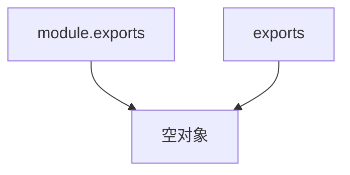

## 前言

虽然一直在使用 Node.js，但是我一直没有系统的学习过 Node.js，都是边查文档边用，这次记录一下学习 Node.js 的过程，加深一下对 Node.js 的掌握。

## 环境

- Node.js - 16.13.2
- macOS - 12.2.1
- ts-node - 10.7.0
- nodemon - 2.0.15
- TypeScript - 4.6.2

## Node.js 的基本概念

*Node.js is an open-source and cross-platform JavaScript runtime environment.*

上面是 Node.js 官方网站上对 Node.js 的描述，翻译过来就是：

*Node.js 是一个开源和跨平台的 JavaScript 运行环境*

另一个很出名也很常用的 JavaScript 运行环境是浏览器，Node.js 和浏览器不同的是 Node.js 不支持 DOM 的操作，也不提供 WEB API，但是 Node.js 让 JavaScript 有了调用操作系统 API 的能力，比如读写入文件，处理网络请求，连接数据库等等，这极大的扩充了 JavaScript 的应用场景，你可以基于 Node.js 使用 JavaScript 开发后端应用、工具类应用等等。

Node.js 还提供了 JavaScript 代码和 C/C++ 代码相互调用的能力，这在 Node.js 的技术架构中叫做 *Node bindings*

**e.g**

```c++
// hello.cc
#include <node.h>

namespace demo {
  using v8::FunctionCallbackInfo;
  using v8::Isolate;
  using v8::Local;
  using v8::Object;
  using v8::String;
  using v8::Value;

  // 定义函数
  void Method(const FunctionCallbackInfo<Value>& args) {
    Isolate* isolate = args.GetIsolate();
    args.GetReturnValue().Set(String::NewFromUtf8(isolate, "hello world").ToLocalChecked());
  }

  // 导出函数
  void Initialize(Local<Object> exports) {
    NODE_SET_METHOD(exports, "sayHello", Method);
  }

  NODE_MODULE(NODE_GYP_MODULE_NAME, Initialize)

}

```

这是一个使用 C++ 定义的函数，函数返回`hello world`，把这个函数命名成sayHello导出。

然后在项目根目录下创建一个 `binding.gyp` 配置文件

```json
{
  "targets": [
    {
      "target_name": "hello",
      "sources": [ "hello.cc" ]
    }
  ]
}
```


```bash
# node-gyp 是 Node.js 提供的编译工具
npm install -g node-gyp

# 生成构建配置
node-gyp configure

# 构建
node-gyp build
```

构建完成之后会得到一个 build 目录，编译后的文件是`build/Release/hello.node`。

然后就可以使用 JavaScript 调用这个 C++ 写的函数了

```js
// main.js

const { sayHello } = require('./build/Release/hello.node');

console.log(sayHello()); // hello world
```

这就意味着用 JavaScript 无法实现的功能，可以用 C/C++ 去实现，然后在 Node.js 中使用。

Node.js 的特点

- 异步 I/O
- 事件和回调函数
- 单线程 （这里指的是 JavsScript 运行在单线程上，并不是指 Node.js 是单线程的）
- 跨平台


## libuv 和 事件循环

libuv 是 Node.js 底层依赖项中很重要的一个依赖库，它是一个高性能的，事件驱动的I/O库，并且提供了跨平台的API。

libuv 我目前还没有专门的学习过，这里提到主要是为了说一下事件循环（Event loop）这个概念，这对掌握 Node.js 很重要。

JavaScript 中有同步任务和异步任务

**e.g.**

```js
console.log(1) // 同步任务

setTimeout(() => console.log(4), 0) // 异步任务

Promise.resolve(3).then(result => console.log(result)) // 异步任务

console.log(2) // 同步任务

// 执行结果是
1
2
3
4
```

上面代码中就有同步任务和异步任务，同步任务很好理解一个任务接着下一个任务执行，异步任务有两个而且是用不同的方式实现的，它们的优先级如何确定？为什么`setTimeout`的延迟是0，它仍然最后才获得结果？要弄清楚这些东西就需要了解事件循环。

> In computer science, the event loop is a programming construct or design pattern that waits for and dispatches events or messages in a program.
> --- [Event loop](https://en.wikipedia.org/wiki/Event_loop)

上面是维基百科对事件循环的定义，翻译过来就是

*在计算机科学中，事件循环是一种编程结构或设计模式，在程序中等待和分配事件或消息。*

伪代码就是：

```js

while (true) {
 // 等待事件触发，然后执行该事件的回调函数
}
```

在 libuv 中事件循环分为六个阶段


- #### timers

    这一阶段用来执行setTimeout 和 setInterval 的回调函数。
    
- #### pending callbacks

    这一阶段用于执行被推迟到下一个循环中的回调函数。
    
    这个有点难理解，libuv的官方文档上有相关的解释：
    
    *Pending callbacks are called. All I/O callbacks are called right after polling for I/O, for the most part. There are cases, however, in which calling such a callback is deferred for the next loop iteration. If the previous iteration deferred any I/O callback it will be run at this point.*
    
    [文档地址](http://docs.libuv.org/en/latest/design.html#the-i-o-loop)
    
    简单的说就是由于某些原因会有些I/O回调函数被推迟到下一次的循环中，如果上一次循环中有被推迟的I/O回调函数，这些函数就会在这次循环中的 pending callbacks 阶段执行。
    
 - #### idle，prepare
 
   仅在 Node.js 内部使用
   
 - #### poll
 
     检索新的I/O事件，执行I/O相关的回调。
     
     Event loop 会在某些场景下停留在这个阶段，但是停留的最大时长是有限制的，这个限制是根据操作系统决定的。
     
     关于这个停留，官网举了一个例子，第一次没仔细看，后面在看的时候发现还是很好理解的。
     
     **e.g.**
     
     ```js
     
     const fs = require('fs');

     // 读取文件 读文件 + 执行回调函数
     function someAsyncOperation(callback) {
       fs.readFile('/path/to/file', callback);
    }

     // 开始时间
     const timeoutScheduled = Date.now();

     setTimeout(() => {
       const delay = Date.now() - timeoutScheduled;

       console.log(`${delay}ms have passed since I was scheduled`); // 21ms have passed since I was scheduled
    }, 10);

     someAsyncOperation(() => {
       const startCallback = Date.now();

       // 等待10ms
       while (Date.now() - timeoutScheduled < 20) {
         console.log('doing something');
       }
     });
     ```
     
     这个例子中setTimeout的回调函数是10ms后执行，但是读文件 + 执行回调函数的时间超过了10ms，我自己执行完的结果是21ms之后setTimeout的回调函数才执行。
     
     过程是这样的：
     
     1. 首先进入timers阶段，由于setTimeout的时间还没到，所以setTimeout的回调函数没有放入timers阶段。
     2. 接着往下执行，发现有一个读取文件的任务，但是还没有执行完成，所以当前poll阶段的回调函数队列也是空的， Event loop 检查发现最近的一个定时器在10ms之后执行，还没有到时间，所以会停留在这里，直到定时器的时间到了，再去执行定时器的回调。
     
     3. 在10ms之内，文件读取完成了，文件读取的回调函数放入了poll阶段，这时候 Event loop 仍然在poll阶段，所以会执行文件读取的回调函数。
     
     3. 等文件读取完成并执行对应的回调函数后，发现时间已经超过10ms了，从check阶段的方向再绕回timers阶段执行setTimeout的回调函数。
     
     这样会导致本该10ms后执行的setTimeout定时器，实际在21ms后才执行。
     
     **注意**: poll阶段最大停留时间和I/O的回调函数执行时长无关，用上面的例子来说：
     
     1. 假如读文件耗时了1ms，但是读文件回调函数执行时长是100ms，那么setTimeout会被延迟101ms。
     
     2. 假如文件读取时长1ms，读文件回调函数执行时长是2ms，那么setTimeout就是准时的，延迟10ms执行。
     
     这里还能得出一个结论就是 setTimeout/setInterval 是不精确的，在浏览器环境下也是不精确的，但是浏览器的 Event loop 和 Node.js 中有些不同，关于浏览器的 Event loop 这个得再写一篇笔记才能说明白。
     
 - #### check
 
 
    Node.js 还提供了一个方法叫做 `setImmediate`，它也是用来执行异步任务的，check阶段就是专门用来执行`setImmediate`的回调函数的，但是在 Node.js 中有这样一种情况：
    
    ```js
    setTimeout(() => {
        console.log('setTimeout')
    }, 0)
    
    setImmediate(() => {
        console.log('setImmediate')
    })
    ```
    
    如果直接执行上面的代码，setTimeout 和 setImmediate 的回调函数执行顺序是不确定的，按照 Node.js 中 Event loop 的概念，应该永远是 setTimeout 先执行，但实际情况却不是这样的。
    
    > 执行计时器的顺序将根据调用它们的上下文而异。如果二者都从主模块内调用，则计时器将受进程性能的约束（这可能会受到计算机上其他正在运行应用程序的影响）。 例如，如果运行以下不在 I/O 周期（即主模块）内的脚本，则执行两个计时器的顺序是非确定性的，因为它受进程性能的约束。
    
    这是官网上的说明，我在 stackoverflow 上面找到了更详细的说明。
    
    [why is the nodejs event loop non-deterministic after the first run?](https://stackoverflow.com/questions/43566082/why-is-the-nodejs-event-loop-non-deterministic-after-the-first-run)
    
    libuv 在启动的时候会同步时间
    
    
    
    
    源码地址: [int uv_run](https://github.com/libuv/libuv/blob/master/src/unix/core.c#L365)
    
    顺着 `uv_update_time` 这个函数一直找下去，会发现它最终调用了一个叫做 `clock_gettime` 的函数，这个函数就是受性能的原因，它是操作系统提供的方法，执行时间受到性能的影响。
    
    而 `setTimeout(fn, 0)` 中的0会被转换成1，这个在文档里也有说明：
    
    > When delay is larger than 2147483647 or less than 1, the delay will be set to 1. Non-integer delays are truncated to an integer.
    
    所以最终的原因就是，如果 libuv 的启动后进入 timers 阶段的时间小于 1ms，setTimeout 的回调是不会放进 timers 阶段的，一直往下走，到了 check 阶段先执行 setImmediate 的回调函数，继续循环，当回到 timers 阶段时再执行 setTimeout 的回调，如果进入 timers 阶段的时间大于 1ms，那么 setTimeout 的回调放入了 timers 阶段，setTimeout 的回调先执行。
    
- close callbacks

    `close` 事件的回调函数在这个阶段执行
    
    **e.g.**
    
    ```js
    const net = require('net');

    const server = net.createServer(socket => {
      socket.on('close', () => {
        console.log('close');
        process.exit();
      });
      socket.on('data', (data) => {
        console.log(`data: ${data}`);
        socket.destroy();
      });
    });

    setTimeout(() => {
      const client = new net.Socket();
      client.connect(4000, () => {
        client.write('hello world');
      });
    }, 1000);

    server.listen(4000, () => console.log('listening'));

    ```
 
 - ### promise 和 process.nextTick  
 
 
   Node.js 中还有两种异步任务，`promise` 和 `process.nextTick`，但是在Event loop 中的6个阶段中都没有提到，这是因为这两种异步任务都是在当前阶段的最后执行的。
   
   **e.g.**
   
   ```js
   setTimeout(() => {
      console.log('timers');

      setTimeout(() => {
        console.log('setTimeout');
      }, 0);

      Promise.resolve('promise').then(res => console.log(res));
      
      process.nextTick(() => console.log('nextTick'));

      setImmediate(() => console.log('setImmediate'));
   }, 0);
   
   // 执行结果：
   // timers
   // nextTick
   // promise
   // setImmediate
   // setTimeout
   ```
   
   解释下上面代码：
   
   1. 进入 timers 阶段，执行 setTimeout 回调，打印出 `timers`
   
   2. 发现有一个新的 `setTimeout` ，于是放入下一次循环中的 `timers` 阶段
   
   3. 遇到 `promise`，将其回调（*.then* 部分）放入当前阶段的最后。
   
   4. 遇到 `process.nextTick`，将其回调放入当前阶段的最后。
   
   5. 遇到 `setImmediate`，将其回调放入本次循环的check 阶段。
   
   6. 本次 timers 结束，准备进入下一个阶段，执行 `promise` 和 `process.nextTick` 的回调函数，从结果来看 `process.nextTick` 的回调函数优先级高于 `promise` 的回调函数，所以先打印出`process.nextTick` 后打印出 `promise`。
   
   7. 继续循环到 check 阶段，执行 `setImmediate` 的回调函数。
   
   8. 本次循环结束，重新从 timers 开始，执行上次循环放入的 `setTimeout` 回调函数，打印出 `setTimeout`。
   
   
   假如是这种情况：
   
   ```js
   const fn = () => {
      console.log('fn');
      process.nextTick(fn);
   }

   setTimeout(() => {
      setTimeout(() => console.log('setTimeout'));
      fn();
   }, 0);
   ```
   
   那就会导致当前阶段一直无法结束，一直在执行 `fn`，需要注意一下。
   

## Node.js 的模块机制

在 ES6 之前 JavaScript 没有模块机制，你如果想要用其他的库必须通过 `<script>` 标签引入，Node.js 是没有`<script>` 标签的，它使用的是 CommonJS 规范。

在 Node.js 中，引入一个模块使用`require`，导出一个模块使用 `modele.exports` 或者 `exports`。


**e.g.**

```js
// a.js
exports.sayGoodbye = () => console.log('Goodbye');

exports.sayHello = () => console.log('hello world');
```

```js
// b.js

module.exports = {
  sayName: () => console.log('MODAO'),
  sayAge: () => console.log(65),
}
```

```js
// c.js

module.exports = () => console.log('done');
```

```js
const { sayGoodbye, sayHello } = require('./a');
const { sayName, sayAge } = require('./b');
const done = require('./exports2');

sayGoodbye();
sayHello();

sayName();
sayAge();

done();
```

上面情况下 `exports` 和 `module.exports` 是一样的，但是有一种情况下只能用 `module.exports`。

```js
exports = () => console.log('error'); // 不要这样使用。

exports = {
 add: () => console.log('add'),
}
```

当重新给exports赋值的情况下，是不能正确导出模块的，会得到一个空对象。

可以这样理解：

假设在 Node.js 的模块中都有这两行代码。

```js
// 伪代码

var module = new Module(...);
var exports = module.exports;
```

然后让 `module.exports` 和 `exports` 都指向同一个对象



但是当导出的时候 Node.js 永远使用的是 `module.exports` 指向的对象。

所以当 `exports = () => console.log('error');` 这样写的时候，`exports` 指向了其他对象，不再和`module.exports` 指向同一个对象，所以这样写导出的模块是一个空对象。

#### ES6 模块和 CommonJS 模块的区别

我之前一直没有特别注意过这两种模块的区别，只是知道ES6 模块使用 import/export 来导入/导出模块，而CommonJS 模块使用 require/module.exports 来导入/导出模块，直到有一次面试中，面试官问我在 Node.js 中可不可以在条件语句中使用 require，比如：

```js
let name;

if (Date.now() === 1650959132980) {
  name = require('name')
}
```

因为平时没有这么使用过，也没有很注意它们之间的区别，所以当时就没答出来，后来去看资料，发现在阮一峰大神写的 [ECMAScript 6 入门](https://es6.ruanyifeng.com/#docs/module-loader#ES6-%E6%A8%A1%E5%9D%97%E4%B8%8E-CommonJS-%E6%A8%A1%E5%9D%97%E7%9A%84%E5%B7%AE%E5%BC%82) 中就做了很详细的对比：

> 1. CommonJS 模块输出的是一个值的拷贝，ES6 模块输出的是值的引用。
> 2. CommonJS 模块是运行时加载，ES6 模块是编译时输出接口。
> 3. CommonJS 模块的require()是同步加载模块，ES6 模块的import命令是异步加载，有一个独立的模块依赖的解析阶段。
> 
> ---- [《ES6 模块与 CommonJS 模块的差异》](https://es6.ruanyifeng.com/#docs/module-loader#ES6-%E6%A8%A1%E5%9D%97%E4%B8%8E-CommonJS-%E6%A8%A1%E5%9D%97%E7%9A%84%E5%B7%AE%E5%BC%82)


通关第二条差异就可以得出答案， 在 Node.js 中可以在条件语句中使用 require。而 ES6 模块是在编译阶段完成模块的加载的，也就是说在代码执行之前，就要完成模块的加载，所以不能使用在运行时才能得到结果的语法结构，比如放在条件语句中加载，但是下面这种情况是可以的：

```js
console.log(name);

import name from 'module';
```

另外关于`ES6 模块的import命令是异步加载`这句话的准确性我自己无法证实，因为inport在代码编译阶段执行，当代码运行的时候，模块是已经完成加载的，所以无法确定 import 命令是异步加载模块的还是同步加载模块的，这部分可能得去了解一下 import 的实现才能确定。